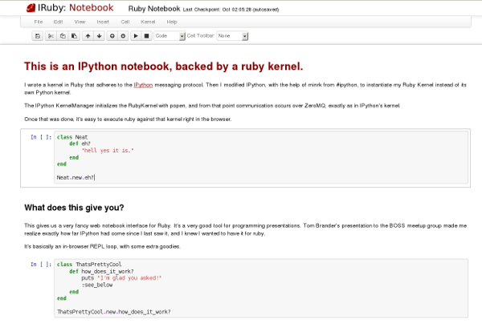

# IRuby

This is a Ruby kernel for IPython.

### Usage

Install the rubygem using `gem install iruby` and then run `iruby notebook` or `iruby`.

Take a look at the [Example Notebook](http://nbviewer.ipython.org/urls/raw.github.com/minad/iruby/master/IRuby-Example.ipynb).

### Authors

See the [CONTRIBUTORS](CONTRIBUTORS) file.

### License

See the [LICENSE](LICENSE) file.
